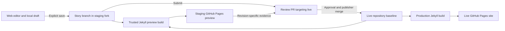

# StoryKit publishing platform: vision and design

**Status:** Discussion draft v0.3 — proposals for iteration, not an implementation specification  
**Date:** September 7, 2026  
**Scope:** An optional author-to-publication workflow layered on StoryKit, its web editor, Jekyll, and GitHub

**Iteration note:** The proposed starting points below are the working direction. Uploaded files are required, and standalone editor support for local images and packages will be built and tested before publishing workflow implementation. Broader file types remain follow-up scope.

**Prerequisite editor work:** Implement and validate the standalone [local story files specification](editor-local-files-spec.md) and [implementation plan](editor-local-files-plan.md) before beginning the publishing workflow. These define the initial image scope and package contracts that this platform can later reuse.

## 1. Vision

StoryKit should let an author develop an interactive narrative, see how it will appear on its intended publication site, and work with editors to publish it confidently. The experience should be understandable without learning Git branches, pull requests, or deployment pipelines. Those underlying mechanisms should remain accessible to people who want them.

The publishing platform adds coordination around durable content. Markdown, YAML, repository assets, and version history remain the source of truth. A published site continues to work if the editor or publishing service disappears. A site can adopt the workflow, stop using it, or replace its interface without converting its stories into another content format.

The author-facing progression is:

**Write → Preview on the publication site’s software → Submit → Revise with feedback → Publish**

The essential promise is that an editor approves an identifiable revision in an identifiable site context, and publication delivers that approved work. A preview that looks convincing but silently represents older text or different runtime assets does not meet that promise.

Initial audiences include classroom publications, research projects, institutional storytelling, and small editorial teams. This is an editorial publishing layer, with room to grow into collections and release management; a general-purpose CMS or real-time collaborative document editor is outside the initial scope.

## 2. Principles and boundaries

| Principle | Design consequence |
| --- | --- |
| Optional adoption | Existing GitHub/Markdown publishing and local editor use continue without platform enrollment. |
| Open, portable content | Stories remain ordinary StoryKit source files; workflow metadata must not be required to render them. |
| Sustainable operations | Prefer GitHub’s existing versioning, review, build, and hosting capabilities; keep custom coordination small and documented. |
| Explicit author intent | Local autosave, repository save, hosted preview, submission, approval, and publication are separate actions and statuses. |
| Preview accountability | Every hosted preview identifies the story revision, production baseline, build configuration, and deployed result. |
| Editorial control | Authors can prepare and submit work; authorized publishers control changes to the live site. |
| Progressive disclosure | Use familiar publishing language, with repository, commit, and build details available when useful. |
| Recoverable operation | GitHub-native review and manual publication remain possible during a platform outage. |

Openness does not mean every draft must be public. Confidential authoring is a separate deployment requirement that must be chosen deliberately, not inferred from the use of a private repository.

## 3. Starting point in this repository

This proposal builds on capabilities already present, while distinguishing earlier aspirations from current behavior:

| Existing capability | Implication for publishing |
| --- | --- |
| Browser-local drafts and revision history; Markdown import/export | Authors can begin without enrollment, and retain a useful exit path. Local storage is not a cross-device backup. |
| Central editor with GitHub OAuth, repository/branch selection, and explicit saves | Extend the existing experience with a publication destination and workflow actions. Signing in still uploads nothing. |
| Per-document repository, branch, path, and SHA bindings | Add publishing identity without replacing the existing conflict baseline or silently rebinding a document. |
| Browser preview using LiquidJS and markdown-it | Keep it as the fast authoring preview. An actual Ruby/Jekyll build provides a separate publication check. |
| Repository-aware layout/configuration fetching, with framework scripts and viewer pages resolved to the canonical StoryKit site | Runtime/version alignment is a prerequisite for a defensible preview fidelity claim. |
| GitHub Actions Jekyll build and Pages deployment on the production branch | Preserve this delivery foundation; introduce preview orchestration and review gates around it. |
| Existing render, viewer, browser, and consistency checks | Reuse these checks, adding workflow-specific acceptance scenarios. |

The current API is limited to repository discovery, branch operations, and Markdown reads/writes (up to 200 KB). It does not yet provide publication registration, submissions, reviews, hosted build coordination, or multi-file asset commits. The central editor’s Cloudflare service already exists; publishing adds responsibilities rather than introducing the first server dependency.

Local references: [Central editor](editor-central.md), [GitHub sign-in design](editor-github-login-design.md), [Editor specification](editor-spec.md), [Technical overview](../technical-overview.md), [Pages workflow](../.github/workflows/pages-deploy.yml), and [Editor checks](../.github/workflows/editor-checks.yml). The current central-editor documentation supersedes the original specification’s static-only authentication assumptions.

## 4. Experience and roles

### Author

An author chooses a publication from the sites they can contribute to, or follows an invitation into that publication’s authoring space. Local writing remains available before this choice. The editor shows the publication’s name, draft visibility, content conventions, and destination.

The author writes with the immediate editor preview. Selecting **Build site preview** saves a specific revision to the publication workspace and queues a real Jekyll build. The UI states that this uploads the selected story and makes the resulting preview available under the publication’s visibility policy. It reports progress, errors, and a preview link once that revision is actually served.

The author can keep writing while a build runs. If the buffer differs from the built revision, the preview is marked **Earlier revision**. Selecting **Submit for review** identifies the exact revision being submitted and any unpublished local changes; it never implies that unsaved changes are included.

Feedback appears as a conversation and, where feasible, source-anchored comments. **Open in editor** returns to the relevant story and revision without discarding local work. After changes, the author saves, rebuilds, and resubmits within the same submission history.

### Reviewer

A reviewer sees a queue with title, author, revision, preview freshness, validation results, and outstanding feedback. They can open the rendered story, inspect the source diff, comment, request changes, or approve. Older preview links remain tied to their original revisions for as long as retention permits.

Approval belongs to the reviewed revision and site context. It does not automatically approve the author’s next save. Human review includes narrative quality, attribution, accessibility, and whether the interactive experience works; a green build cannot determine all of these.

### Publisher and administrator

A publisher can release approved work. A site administrator configures contributors, reviewers, publication policy, repository integration, and retention. A small project may assign both roles to the same person; a larger institution may separate them.

**Approve** means editorial acceptance. **Publish** initiates the production merge and deployment. **Published** means the expected production deployment succeeded and the story is available at its live URL. These remain distinct even when one person performs all three steps.

For the first pilot, authors use the editor and reviewers/publishers may use GitHub’s existing PR interface. A dedicated review dashboard can follow after the workflow is proven.

## 5. Repository and review options

The staging-site idea is sound as a separation between work in progress and the live site. Three choices should be treated independently: where author branches live, where the authoritative review lives, and where rendered previews are hosted.

| Option | Strengths | Costs and limitations |
| --- | --- | --- |
| A. Author branches and review PRs in the live repository; separate preview host | Fewest moving parts; direct GitHub review and merge history | Author access and draft source live alongside production; requires careful permissions and a separate preview deployment mechanism. |
| B. Author branches in a staging fork; review PRs target live | Separates author workspace from production writes; one review history; native cross-fork promotion | Fork policies and cross-repository automation need setup; source visibility follows the chosen repository arrangement. |
| C. Author branches and review PRs in staging; approved work produces a second PR into live | Staging owns editorial intake; useful when production accepts only approved packages | Two records, approval handoff, synchronization, and duplicate-discussion risks; needs explicit revision/provenance mapping. |
| D. Independent authoring repository; approved content copied into a live PR | Flexible ownership and visibility; avoids dependency on fork relationships | Must implement precise content transfer, conflict handling, provenance, and asset dependency tracking. |

**Recommended first hypothesis: B, with an administrator-managed staging fork and one branch per story.** It preserves the proposed staging author workspace while keeping the canonical editorial review on the PR that will actually change production. Authors experience a publication submission, even though the underlying PR targets live.

This is a deliberate refinement of “submissions go to staging.” If keeping the authoritative review entirely in staging is a firm product requirement, choose C. In C, record the accepted staging commit and preview context, create a content-only production PR, and require a final verification against the current live baseline. Never treat “merged to staging” as sufficient authority to publish an unspecified later revision. Keep the editorial conversation in staging and link both records.

A fork is an initial implementation choice, not part of the permanent content model. Publication configuration should identify separate source and target repositories so that a later adapter can support D. Confirm organization fork rules, visibility requirements, and actual contributor permissions before adopting B for a site.

### Proposed topology for B

The staging fork maintains a clean baseline tracking an explicit live commit. New story branches start from that baseline. Staging configuration and preview machinery must not accumulate in the content branches’ production diffs; supply deployment differences through trusted workflow configuration and build overlays. Do not merge all work into a shared staging branch and later merge that branch wholesale into live.

Each publication has an independent release queue. Each story’s submission contains its own content and declared assets, allowing story A to publish while story B remains under review.

## 6. Two preview levels and a fidelity contract

| Preview | Purpose | Contract |
| --- | --- | --- |
| Editor preview | Immediate iteration on text and interactions | Represents the current buffer with the browser renderer; identifies missing resources and known compatibility gaps. |
| Hosted site preview | Author acceptance and editorial review | Runs the actual production-compatible Jekyll toolchain against an identified candidate site, then serves static output through GitHub Pages. |

The hosted preview should render **current production plus this story’s proposed changes**, not an arbitrary old copy of staging or a mixture of all pending stories. Build a temporary candidate tree from a recorded live baseline and the story’s change set. Existing published stories, navigation, category pages, and shared resources remain present so reviewers can assess site integration.

A preview record identifies:

- Publication and stable story/submission ID.
- Source repository, branch, and commit; changed-file manifest and content hashes.
- Live baseline commit and candidate tree identity.
- Jekyll/Ruby dependencies, theme/StoryKit versions, trusted workflow version, and configuration overlay hash.
- Build run, artifact digest, deployment identity, preview URL, and completion time.

Use the same layouts, plugins, theme, dependency lockfile, and StoryKit assets as the intended production build. Hosting differences are explicit: preview `url`/`baseurl`, a preview notice, disabled analytics, indexing prevention, and disabled preview PWA/service-worker caching. Validate how those differences affect absolute links, viewer iframe paths, media, canonical metadata, feeds, and social metadata.

The current editor’s canonical runtime references need investigation: either resolve publication assets to pinned versions or make version differences visible. A revision is not reproducible if its viewer code silently changes at a mutable URL. External media and services can still change or disappear; track important dependencies and disclose that boundary in preview diagnostics.

### Draft visibility in Jekyll

Jekyll normally excludes unpublished and future-dated content unless configured otherwise. The preview build should include the selected story using a controlled build-time transformation or configuration, while preventing unrelated drafts from entering the output. Avoid globally turning on every unpublished story in a repository. Final publication metadata—including `published`, date, slug, permalink, and author—must be present in the reviewed candidate before approval; do not silently change it during promotion. [Jekyll configuration options](https://jekyllrb.com/docs/configuration/options/).

### Concurrent previews on GitHub Pages

GitHub Pages provides at most one project site per repository. A branch does not automatically receive its own independently hosted Pages site. StoryKit therefore needs an explicit preview deployment design. [GitHub Pages site types](https://docs.github.com/en/pages/getting-started-with-github-pages/what-is-github-pages).

Recommended pilot: use the staging repository’s Pages site as a preview collection. Assemble complete Jekyll outputs under paths such as `/previews/<story-id>/<build-id>/`. Each build gets its own `baseurl` during Jekyll rendering. Keep immutable paths for retained builds; a convenience “latest” link may move but must not be the approval reference.

Builds can run concurrently, but a trusted aggregator serializes publication of the collection. Each Pages deployment contains the full retained collection, preserving other authors’ previews. Store build artifacts and a manifest outside the deployed site; never use the last served HTML as the only recoverable copy. Reconcile the latest manifest before deployment so concurrent completions or cleanup cannot overwrite another preview. GitHub’s custom workflow supports artifact-based deployment; collection assembly is proposed StoryKit functionality. [Custom Pages workflows](https://docs.github.com/en/pages/getting-started-with-github-pages/using-custom-workflows-with-github-pages).

Start with a small, bounded collection. Full-site copies consume storage and deployment time; set per-publication build quotas, retention, and size limits after measuring a representative site. A repository per preview is an alternative with greater provisioning overhead. A dedicated preview hosting provider is a later option if scale or access control warrants it, while keeping Jekyll builds and production on GitHub.

## 7. Submission lifecycle and release integrity

Use separate status dimensions rather than one overloaded “saved” indicator:

| Dimension | Example states |
| --- | --- |
| Local/repository synchronization | Saved in browser; local changes; saved to repository; conflict |
| Preview | Not built; queued; building; deployed/current; deployed/older revision; failed; expired |
| Editorial | Draft; submitted; changes requested; approved; withdrawn; declined |
| Release | Not released; publishing; published; deployment failed; reverted |

In the recommended model, **Build site preview** creates or updates the story branch without creating a review PR. **Submit for review** opens the canonical PR against live, attaching the current preview and manifest. Subsequent revisions update that PR. Withdrawal closes it without publication; reopening preserves the history when the branch and destination are still valid.

Require a current successful preview before submission in the pilot. A more permissive “submit with build problems” policy can be added later if editors want early technical triage.

Any new submitted content revision invalidates approval. If the live baseline changes, mark the candidate preview stale and rebuild against the new baseline. For the pilot, require renewed confirmation of the refreshed candidate before publishing. Later, carefully scoped policies may distinguish unrelated changes from changes that affect rendering.

At publication, verify the approved source commit, current live baseline, candidate tree, required checks, and reviewer authorization. Serialize the final release step and use an atomic ref/merge precondition so a last-second branch update cannot publish different work. A changed head or base requires reconciliation; disabling the Publish button alone is insufficient. GitHub’s protected branches support review and check requirements, including stale approval handling; exact-preview readiness needs an additional required check from a trusted integration. [Protected branches](https://docs.github.com/en/repositories/configuring-branches-and-merges-in-your-repository/managing-protected-branches/about-protected-branches).

Merge the reviewed source changes and rebuild for production with the production URL configuration. Do not copy preview HTML into live: preview paths and metadata intentionally differ. Compare production source/build provenance with the approved candidate, then perform live smoke checks. Report a deployment failure as **Approved, publication failed**, retaining the previous successful live deployment wherever possible.

## 8. Content packages and durable records

A story is a Markdown entry point plus its dependencies, not necessarily one file. The platform needs a stable story identity independent of filename and title, and an explicit set of additions, modifications, renames, and deletions included in a submission.

**Uploaded files are part of the intended submission model.** The publishing pilot inherits the standalone editor’s Markdown-plus-images package support. Reuse its package identity, file manifests, and revision semantics; broader uploaded file types can follow without replacing that model. Detect unavailable local dependencies and block hosted preview/submission with a useful explanation rather than submitting an incomplete story.

Story-owned assets follow the delivery platform’s existing convention: front matter sets `media_subpath: /assets/posts/<post-id>`, where post ID is the filename slug without its date prefix or Markdown extension. Source references such as `photo.jpg` resolve through that prefix; package manifests record the full repository-relative path, such as `assets/posts/monument-valley/photo.jpg`. Preserve existing explicit media prefixes. Stable workspace/submission IDs are independent of asset directories, and title/date/filename changes must not silently relocate files. Changes to shared data, author records, or assets require explicit inclusion and additional review. Deleting an asset must account for references from other published stories. Revisions start from the current live story, and URL changes need a redirect plan.

### 8.1. An editor-managed story workspace

The editor should support three asset sources: external URLs, files already in the bound repository, and files added or created in the current browser. Local assets belong to the story workspace before they belong to a publication. This capability should also work for authors who never enable the publishing workflow.

Today, local image drops produce a notice directing the author to upload through GitHub; the editor does not ingest the file. Its persistent stores contain documents, text revisions, and caches, with no managed binary-asset store. Its renderer’s `resolveFile` hook returns text for source files; it is not a complete solution for serving local binary media to nested viewers. These are explicit areas of new work. See [drop handling](../editor/dnd.js), [storage](../editor/store.js), and [preview context](../editor/context.js).

Provide **Add files** alongside drag-and-drop and supported clipboard input. Copy accepted files into persistent browser storage, assign stable asset IDs and proposed repository paths, and insert ordinary StoryKit/Markdown references. Do not rely on continued access to the original file on the author’s computer. Imported files and files created through a future editor tool—for example a GeoJSON overlay—use the same asset lifecycle; specialized data-editing tools can be added separately.

A small **Story files** panel shows filename, type, size, usage, and save state. It supports insertion, replacement, removal, and export, with appropriate caption, attribution, license, and alternative-text fields. Use a compatible viewer when one exists; otherwise offer a download link or explain the unsupported preview type. Accepting a file does not imply StoryKit has an interactive viewer for it.

### 8.2. Local persistence and preview

**Add to story** means save in this browser. **Save to GitHub** or **Build site preview** uploads the selected package. Signing in or adding a file alone does not upload it. The UI distinguishes local-only, repository-saved, modified, and missing assets, and explains browser storage failures without claiming the file was saved.

Persist file bytes separately from Markdown, with a manifest mapping stable asset IDs to paths, media types, sizes, and content hashes. Document revisions must reference matching asset revisions so restoring earlier prose also restores the intended media. Pruning must retain files referenced by retained revisions. Account switching preserves local work under the editor’s existing shared-browser model; cross-device recovery requires repository sync or package export.

Store portable paths in source, never `file:`, temporary `blob:`, or editor-session URLs. During editor preview, resolve those paths against the local package first, then the pinned repository context. Temporary media URLs or a constrained binary-message bridge may supply bytes to preview frames, but they must not enter saved Markdown. This requires testing across the opaque preview sandbox and nested viewer origins; a blob URL that displays in the editor is not proof that an iframe image viewer or a data-fetching map can use it. Extend the preview resource contract deliberately, without weakening its authentication boundary.

The first asset increment should prove ordinary images end to end. File families such as GeoJSON, CSV, PDFs, audio, and video can follow with explicit viewer support and limits. Linked resources inside data files require dependency handling too. When local preview cannot render an otherwise supported package, show that limitation and offer a hosted build after saving; never silently render an older remote asset instead.

### 8.3. One saved revision includes text and files

Capture a package snapshot when saving or requesting a hosted preview. Upload changed assets and Markdown, then expose them through one commit and a conditional branch update. The branch should advance only once the complete snapshot is available. Partial transfer failures leave the previous usable branch revision intact and local files available for retry. This requires new multi-file synchronization beyond the current Markdown-only endpoint.

Edits made during transfer belong to the next package revision. Detect conflicts against the baseline for all changed paths. A same-name upload must offer an explicit replacement or a new unique path; replacement changes the asset hash and invalidates approval even when the prose is unchanged. Binary conflicts need a choice of version or a new filename, not a text merge.

Reviewers need to see asset additions, replacements, and removals alongside the Markdown diff, with appropriate previews and metadata. The build manifest records the exact asset versions used; publication promotes those versions, not a fresh fetch of whichever file now occupies the same path.

### 8.4. Portability and storage policy

Add **Export story package** and corresponding import using an ordinary archive containing Markdown, owned files, and an optional manifest. Preserve existing Markdown-only export, but make clear when it omits local assets. The package’s content should remain usable without StoryKit-specific storage IDs or the central service.

Prefer repository storage for bounded story assets as the first implementation: source and files then share a reviewable history and deploy together. Set supported types, per-file/package limits, and image-derivative policy explicitly. Validate both paths and content; HTML, SVG, and other active formats need a policy consistent with preview isolation. Preserve originals or make conversion explicit rather than silently changing the uploaded content.

Large audiovisual files and image collections may need a separate storage/delivery service. Leave that as a later architecture decision with explicit preservation and export obligations. Adding such a service must not silently turn an uploaded, story-owned file into an untracked external dependency.

### 8.5. Durable workflow records

Keep rendering metadata in front matter. Keep submission history and operational state outside the rendering contract:

| Record | Durable home | Purpose |
| --- | --- | --- |
| Story source and owned assets | Git commits | Portable publication content and revision history |
| Publication configuration | Versioned administrator-controlled file | Repository mapping, content paths, trusted runtime/build settings, policies |
| Submission and review | Canonical GitHub PR, reviews, and comments | Discussion, decisions, and source diff |
| Build/release manifest | Versioned or exportable GitHub-side record, linked from PR | Binds approved input to preview and production deployment |
| Sessions, job queue, webhook deduplication, UI cache | Small service database | Authentication and coordination; not the sole copy of content or approvals |

The existing service keeps drafts out of its database. Preserve that property. Add durable workflow metadata only where needed, with a documented export/reconstruction procedure. Retain release manifests independently of expiring workflow logs and artifacts. Prototype the exact GitHub-side manifest storage format before treating recovery as solved.

## 9. Authentication, permissions, and visibility

Keep ordinary editor synchronization on the existing OAuth path initially. For managed publishing, evaluate a site-installed GitHub App: it provides selected-repository installation and granular permissions suited to an administrator enrolling a live/staging pair. Installation overhead buys a clearer publication boundary. [GitHub App capabilities](https://docs.github.com/en/apps/creating-github-apps/about-creating-github-apps/about-creating-github-apps).

Separate identity from authority. A signed-in author is not entitled to operate every enrolled site. The service must check publication membership and the requested operation on every mutation, especially when acting with an installation token whose repository authority exceeds the author’s personal access. Pilot with invited GitHub users; guest authors without GitHub accounts are a later identity and governance decision.

Author, reviewer, and publisher permissions must be enforced on the server and in repository protections. UI role labels and editable PR labels are not sufficient. Protect live, baseline, workflow, and deployment branches; restrict direct production writes and the ability to forge readiness checks. Do not give the publishing integration routine bypass authority over review gates.

A public staging repository exposes draft source and review history. A private source repository also does not by itself make Pages private: ordinary Pages output is public. GitHub documents restricted Pages access for eligible Enterprise Cloud organization sites. The pilot should explicitly use public, non-confidential drafts; confidential workflows need verified access control for source, reviews, preview HTML, and assets before adoption. `noindex` and hard-to-guess URLs do not provide privacy. [Publishing-source visibility](https://docs.github.com/en/pages/getting-started-with-github-pages/configuring-a-publishing-source-for-your-github-pages-site), [Pages access control](https://docs.github.com/en/enterprise-cloud@latest/pages/getting-started-with-github-pages/changing-the-visibility-of-your-github-pages-site).

### Build and browser trust boundaries

Story content can contain HTML, scripts, Liquid, and external embeds. A repository collaborator can potentially edit more than the paths offered in the editor. Validate submission diffs against allowed content paths and disallow workflow, plugin, layout, configuration, dependency, and executable changes in the author publishing lane. Framework changes use a separate maintainer workflow.

Run the candidate build using trusted workflow code and trusted build dependencies, with author content treated as untrusted input, resource limits, and no production credentials. A separate trusted deployment job validates artifact provenance and publishes static output without executing it. Do not build untrusted PR code in a privileged `pull_request_target` context. Fork-triggered runs have token/secret restrictions, and PR events occur in the base repository; implement preview-before-submission using an authenticated dispatch to the trusted staging workflow. Validate event routing and organization approval rules in the pilot. [GitHub Actions event behavior](https://docs.github.com/en/actions/reference/workflows-and-actions/events-that-trigger-workflows).

Hosted previews must be separate from the authenticated editor origin and preferably from the live site origin. Two repositories under the same `<owner>.github.io` hostname share an origin despite different paths. Provision a distinct staging hostname/account as appropriate, and prevent preview service workers or scripts from reaching editor sessions or production-origin storage. A shared preview hostname also means previews share an origin with one another; the initial model assumes invited contributors and no sensitive browser state on that host. Stronger mutual isolation requires another hosting design.

## 10. Failure handling and ongoing operations

| Situation | Expected behavior |
| --- | --- |
| Author edits while a preview builds | Complete the requested revision; label it older if the document has moved on. |
| Save or submit response is lost | Reconcile remote commit/PR state using an operation ID before retrying; avoid duplicate submissions. |
| Another author or administrator changes the same file | Preserve local text and invoke conflict resolution; never overwrite silently. |
| Production changes while review is open | Rebuild the candidate on the new baseline; require the applicable renewed approval. |
| Preview build or external resource fails | Show actionable diagnostics; preserve the previous preview with its older-revision label. |
| Two previews finish together | Serialize collection deployment; retain both outputs. |
| Webhooks arrive twice or out of order | Deduplicate, read current GitHub state, and reconcile; never move backward based only on event arrival order. |
| Login expires, app access is revoked, or source branch disappears | Retain local draft and known provenance; explain recovery and destination choices. |
| Production build/deploy fails after merge | Keep editorial approval separate from release status; allow retry of the same revision or a reviewed corrective/revert PR. |
| Published story needs correction | Start a new revision from live; keep the public story available during review. |
| Publication must be reversed | Revert the relevant source change and rebuild; avoid resetting the whole site and losing later stories. |
| Preview expires or submission is withdrawn | Remove it according to retention policy; keep review/release records and report expired links clearly. |

The operator owns app installation health, workflow versions, credentials, webhook reconciliation, preview collection storage, quotas, and cleanup. The site administrator owns editorial policy, contributor enrollment, and content retention. Queue/status data should be exportable, and GitHub state should be periodically reconciled so missed webhooks do not require database surgery.

Suggested initial retention policy for discussion: retain the latest preview and any actively reviewed revision; expire superseded unreviewed builds after a short configurable window; retain the approved preview for a configurable period after publication and keep its manifest longer. Withdrawn public material may survive in Git history or third-party copies; deletion of a preview is not a promise to erase its prior public distribution.

Measure preview latency, build failures, artifact growth, stale-review rebuilds, time from submission to publication, and manual recovery effort. Propose an initial preview target of a few minutes for a representative small site, then set an actual service target from pilot results rather than promising one in advance.

## 11. Adoption, portability, and offboarding

An administrator enrolls a site by selecting live and staging repositories, setting visibility, selecting allowed content paths and reviewer/publisher roles, installing trusted workflows, configuring protection rules, and completing a test preview/release. Check platform and plan capabilities during enrollment; an unavailable enforcement mechanism should not be presented as active.

The site receives a portable configuration and an operator guide. Publishing controls appear only for enrolled destinations; ordinary Save to GitHub remains available elsewhere. Changing a document’s publication is an explicit operation that preserves its previous source reference.

If the platform is unavailable, authors can export Markdown or work in GitHub. Editors can review the existing PRs, and administrators can run the documented Jekyll build and release process. If a custom readiness check cannot run, an administrator may deliberately switch to the documented manual policy; the service must not silently bypass it.

Offboarding exports manifests and configuration, preserves repositories and reviews, removes platform automation and access, and leaves a conventional StoryKit site with a functioning production build. Long-term sustainability also requires deliberate runtime releases, dependency documentation, and an asset preservation strategy; GitHub storage alone does not preserve external media services.

## 12. Prototype sequence and acceptance criteria

### Step 1 — Validate the publishing mechanics

Use one disposable live/staging pair, two authors, one reviewer/publisher, and public non-sensitive content. Implement the GitHub/Jekyll workflow first, using manual GitHub controls where useful. This avoids designing a polished interface around unproven deployment assumptions.

Prove branch creation, preview-before-submission, two concurrent revision-specific previews, a cross-fork PR, changes requested, renewed review, publication, and rollback. Use an existing representative narrative with image, map, video, and action-link interactions, plus a second story to expose interference.

### Step 2 — Integrate author actions

Add publication enrollment/discovery, **Build site preview**, **Submit for review**, precise status indicators, and links into GitHub review. Keep existing draft persistence, conflict detection, account switching, and exports intact. Review remains in GitHub initially.

### Step 3 — Pilot the editorial experience

Add a small review queue and feedback view if the pilot shows GitHub is the main barrier. Extend reviewer roles and publication checks where real usage requires them. Evaluate whether the two-PR staging-first model better fits institutional partners.

### Required asset increment — standalone editor prerequisite

Uploaded files are committed scope for the platform. First complete the standalone editor feature: add a local image, retain it across reload, preview it in a StoryKit viewer, save the text and image together, restore a replacement’s earlier revision, and export/reimport it. Validate its output with real Jekyll independently of this publishing workflow. The subsequent publishing pilot adds review of replacements and publication of the exact approved package using those established contracts. Defer a general asset library and large-media infrastructure, rather than treating file support itself as optional.

Asset acceptance includes failed local persistence, transfer interruption, concurrent text edits, same-name collisions, replacement-only approval invalidation, historical revision restoration, and isolation of local media in nested preview frames. Demonstrate that package export/reimport preserves both text and bytes and that no temporary preview URLs appear in repository content.

### Required evidence before expanding the pilot

- A rendered preview identifies its exact revision and baseline; editing during a build never relabels old output as current.
- Story A can publish without story B’s unpublished content or assets entering production.
- A second author’s deployment cannot remove or replace the first author’s retained preview.
- Changing the source, publication metadata, runtime, or live baseline invalidates the relevant readiness/approval state.
- The release precondition catches a branch change between opening the Publish view and executing the merge.
- Preview and production pass representative desktop/mobile interaction, routing, and visual comparisons; intentional hosting differences are documented.
- A source draft excluded by normal Jekyll rules can be previewed without exposing other drafts.
- A rejected content-path change cannot execute contributor-supplied workflow/plugin code with publisher authority.
- Preview pages cannot access editor credentials or production-origin storage.
- Duplicate requests, failed deployment, removed branches, and service outages have demonstrated recovery paths.
- Published content and its review provenance remain recoverable without the publishing database.
- A non-technical author can write, preview, submit, and revise without manually managing a branch or PR.

Deferred capabilities include guest accounts, confidential hosting, simultaneous coauthoring, scheduled releases, multi-story issues/editions, multilingual workflows, DOI integration, analytics dashboards, and complex asset-library management. Future viewer types should enter through the existing content/build validation contract, without redesigning publication states for each viewer.

## 13. Decisions for the next iteration

| Decision | Proposed starting point | What would change it |
| --- | --- | --- |
| Must the authoritative submission live in staging? | One PR targeting live, sourced from staging (B) | Institutional intake must be separate from the production repository: choose C. |
| Are unpublished drafts allowed to be public? | Public, non-confidential pilot | Confidential/embargoed work requires a verified private-preview architecture. |
| Who are the first contributors? | Invited GitHub users | Broad public submissions or account-free authors require more admission and identity work. |
| Where does editorial review happen first? | GitHub PRs, linked from the editor | Reviewer usability findings justify an integrated queue and commenting UI. |
| What file support does the publishing pilot inherit? | Standalone editor image/package support is built and tested first; submission uses that package | Broader file types, asset management, and grouped publication remain follow-up scope. |
| Who can release approved work? | Explicit publisher action; one independent reviewer | A small personal site may combine roles; larger sites may require multiple approvals. |
| How strict is preview freshness? | Rebuild and reconfirm after source or baseline changes | Pilot data supports a reliable narrower invalidation policy. |
| How is the optional service operated? | Extend the existing central service with a distinct publishing module | Institutional hosting or scale warrants a separately deployable coordinator. |
| How are previews retained? | Bounded collection on staging Pages | Measured storage, privacy, or URL-isolation needs justify different preview hosting. |

The proposed defaults for review location, visibility, roles, and hosting are the working direction for the pilot. First implement and test the standalone editor image/package feature described in its specification and plan. The publishing pilot can then test review and release behavior against an established authoring and file model while preserving ordinary, inspectable static-site publishing underneath it.
